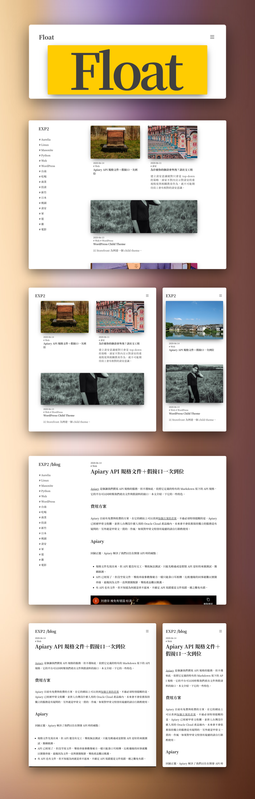

**[Taiwanese](README.md)**

Float, a theme for [Zola](https://www.getzola.org/).

[[_TOC_]]

## Features

- Responsive. Optimized for all size devices.
- Provide regular and wide article card. Feature articles are highlighted with the wide card.
- You can specify a feature image in front-matter. For an article without a specified feature image, a random image from [Unsplash Source](https://source.unsplash.com/) will be used.
- Feature images have variant sizes to optimize from DPR 1.0 to 3.0 devices.
- HTML native image lazy loading.
- Embedded semantic meta tags, including HTML SEO tags, [Open Graph](https://ogp.me/) tags, [Twitter Cards](https://developer.twitter.com/en/docs/tweets/optimize-with-cards/overview/abouts-cards) tags.
- Integrated [Google Analytics](https://analytics.google.com/).
- Integrated [Google AdSense](https://adsense.google.com/).
- Optimized layout for [AdSense Auto ads](https://support.google.com/adsense/answer/9261306).
- Integrated [LikeCoin](https://like.co/).
- Integrated [utterances](https://utteranc.es/). Use [GitHub](https://github.com/) issue as commenting system.

## Installation

In your Zola folder:

Add Float as a Git submodule:

```sh
git submodule add https://gitlab.com/float-theme/float.git themes/float
```

Edit your config.toml. Assign `float` to `theme`:

```toml
theme = "float"
```

Edit your config.toml. Add `tags` as a taxonomy:

```toml
taxonomies = [
    {name = "tags", paginate_by = 10},
]
```

Copy float/content/ all sub folders and files to your conten/:

```sh
cp -r themes/float/static/* static/
```

Copy float/content/ all sub folders and files to your conten/:

```sh
cp -r themes/float/content/* content/
```


## Using

### Article and images

Article and images are co-located in the same folder:

```
content/
└── blog/
    └── 2020/
        └── 2020-06-15-Zola-Theme-Float/
            ├── index.md
            ├── pic1.png
            ├── pic2.png
            └── qa_report.pdf
```

Article content and front-matter are in index.md. Images are in the same folder.

### Front-matter

Some additional data are added into `[extra]` section of front-matter:

```toml
title = "Float theme for Zola"
description = "Float features and usage guide"
draft = false
[taxonomies]
tags = ["Float", "Zola"]
[extra]
feature_image = "pic1.png" # Article card image
feature = true # Wide article card applies to feature article
link = "" # Assign another link to the card to insteak linking to the post page
```

## Customization

Add below variables to your `[extra]` of config.toml to customize your blog:

```toml
[extra]
main_section = "blog"

copyright = ""

web_fonts = "<link rel='stylesheet' href='https://fonts.googleapis.com/css2?family=Noto+Serif+TC:wght@500;700&display=swap'>"

google_analytics = false
# google_analytics_id = "UA-XXXXXX-X"

google_adsense = false
# google_adsense_id = "ca-pub-XXXXXXXXXXXXXXXX"

twitter_account = "@xxx"

likecoin = false
# likecoin_name = "xxx"

utterances = false
# utterances_repo = "xxx/xxx"
```

### Font

Font CSS is at float/sass/font.scss. To change font, copy float/sass/font.scss to your sass/font.scss and edit the file.

## Known issues

- `paginate_by` must be 10. Zola template does not provide `paginate_by` from `get_section()`, so the 10 articles per page is hard coded in template files.
